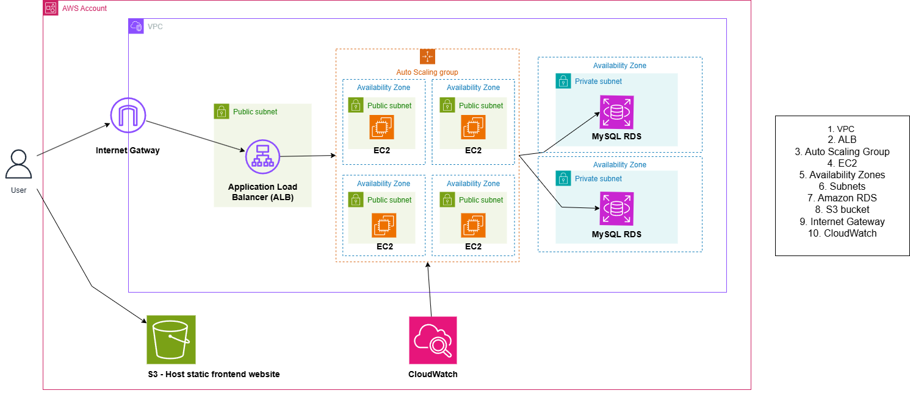

# Lena Beauty Spa Management System

## Overview

Lena Beauty Spa is an enterprise-grade appointment booking and management platform designed for spa and wellness businesses. The system provides a comprehensive solution for customer appointment scheduling, service management, and business operations through a modern web-based interface.

## Demo

*Click to view the complete application demonstration*

## System Architecture

The application follows a three-tier architecture pattern deployed on Amazon Web Services, ensuring scalability, reliability, and security.

## Technology Stack

### Backend Infrastructure
**Java Spring Boot Framework**
- RESTful API architecture following industry best practices
- Spring Security framework for comprehensive authentication and authorization
- Spring Data JPA for efficient database abstraction and ORM
- JWT (JSON Web Token) implementation for stateless authentication
- JavaMail API integration for automated email communications
- Maven dependency management and build automation

### Frontend Application
**TypeScript Angular Framework**
- Single Page Application (SPA) architecture
- Component-based design with Angular Material UI
- Reactive programming with RxJS for asynchronous operations
- TypeScript for enhanced code quality and maintainability
- Responsive design supporting multiple device formats
- Role-based UI rendering and access control

### Cloud Infrastructure (AWS)

**Compute Services**
- **Amazon EC2**: Elastic compute instances hosting the Spring Boot backend
- **Auto Scaling Groups**: Dynamic scaling based on demand and performance metrics
- **Application Load Balancer**: Intelligent traffic distribution across multiple instances

**Storage and Database**
- **Amazon S3**: Static website hosting for Angular frontend with high availability
- **Amazon RDS MySQL**: Managed relational database with Multi-AZ deployment
- **Automated backups**: Point-in-time recovery and data protection

**Networking and Security**
- **Virtual Private Cloud (VPC)**: Isolated network environment with custom subnets
- **Internet Gateway**: Secure internet connectivity for public-facing resources
- **Security Groups**: Network-level firewall rules and access control

**Monitoring and Management**
- **Amazon CloudWatch**: Real-time monitoring, logging, and alerting
- **Auto Scaling Policies**: CPU utilization-based scaling triggers
- **Performance metrics**: Application and infrastructure monitoring

## Core Functionality

### API Operations
The system implements comprehensive CRUD operations:
- **Create**: New appointment booking with validation and conflict detection
- **Read**: Appointment retrieval with filtering and search capabilities
- **Update**: Appointment modification with business rule enforcement
- **Delete**: Appointment cancellation with proper notification workflows

### Security Implementation
- **JWT Authentication**: Stateless token-based authentication system
- **Role-Based Access Control (RBAC)**: Granular permissions for Admin and User roles
- **API Security**: Protected endpoints with proper authorization checks
- **Data Encryption**: Secure data transmission and storage protocols

### Communication System
- **JavaMail Integration**: Automated email notification system
- **Booking Confirmations**: Real-time email confirmations for appointments
- **Administrative Announcements**: Broadcast messaging to user base
- **Template Management**: Customizable email templates for different scenarios

## Business Features

### Customer Management
- User registration and profile management
- Appointment history and tracking
- Service preferences and customization
- Loyalty program integration capabilities

### Administrative Dashboard
- Comprehensive booking management interface
- Service catalog administration
- User account management and oversight
- Business analytics and reporting tools
- System configuration and settings management

### Operational Excellence
- **Intelligent Scheduling**: Advanced time slot management preventing double bookings
- **Real-time Availability**: Dynamic calendar updates and conflict resolution
- **Automated Workflows**: Streamlined booking processes and confirmations
- **Scalable Architecture**: Handles varying load patterns efficiently

## Infrastructure Highlights

### High Availability
- Multi-Availability Zone deployment ensuring 99.9% uptime SLA
- Automated failover mechanisms for database and application tiers
- Load balancing across multiple application instances

### Scalability
- Horizontal scaling capabilities through Auto Scaling Groups
- Database read replicas for improved performance
- CDN integration potential for global content delivery

### Security
- Network isolation through private subnets for database tier
- Public subnets for application tier with controlled access
- Comprehensive logging and audit trails
- Regular security updates and patch management

### Cost Optimization
- Dynamic resource allocation based on actual demand
- Automated scaling policies to minimize operational costs
- Reserved instance utilization for predictable workloads

## Development Practices

- **Clean Architecture**: Separation of concerns and modular design
- **RESTful Design**: Industry-standard API design principles
- **Test-Driven Development**: Comprehensive unit and integration testing
- **CI/CD Pipeline**: Automated deployment and quality assurance
- **Code Quality**: Static analysis and code review processes
- **Documentation**: Comprehensive API documentation and system guides

## Performance Metrics

- **Response Time**: Sub-200ms API response times under normal load
- **Throughput**: Supports 1000+ concurrent users
- **Availability**: 99.9% uptime with automated monitoring
- **Scalability**: Auto-scaling from 2 to 20 instances based on demand

---

**Lena Beauty Spa Management System** - Professional, scalable, and secure spa management solution.