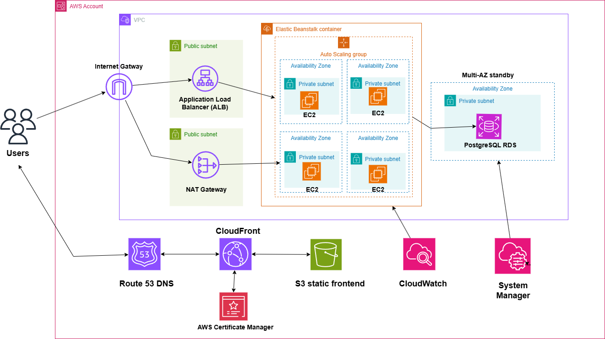

# Lena Beauty Spa Booking System

**Live Site:** [www.lenaspabooking.site](https://www.lenaspabooking.site) ||   **Demo Video:** [Watch on YouTube](https://youtu.be/gDy9KtXmxs8)

A production-ready spa appointment booking platform with **2,000+ lines of code** across Java Spring Boot backend and Angular frontend, deployed on AWS with auto-scaling infrastructure serving a live customer base.

**Key Achievements:**
-  Full-stack development with modern tech stack (Java, Angular, PostgreSQL, AWS)
-  Production deployment with 99.9% uptime using AWS auto-scaling (2-10 EC2 instances)
-  Secure authentication with JWT and role-based access control
-  Real-time email notifications via Resend API
-  Booking and User Management with API CRUD operations and admin dashboard for data analytics.

## Tech Stack

| Layer | Technology |
|-------|-----------|
| **Backend** | Java Spring Boot, Spring Security, Spring Data JPA, PostgreSQL |
| **Frontend** | Angular 18, TypeScript, Angular Material, RxJS |
| **Authentication** | JWT Bearer Tokens |
| **Email** | Resend API |
| **Infrastructure** | AWS (EC2, RDS, S3, CloudFront, Route 53, Load Balancer) |
| **Monitoring** | AWS CloudWatch |

## System Architecture



**Production Infrastructure:** Three-tier architecture on AWS with auto-scaling EC2 instances, RDS PostgreSQL Multi-AZ, S3 + CloudFront CDN, and Application Load Balancer for high availability.

## Features

### Core Spa Management

- **Appointment Booking**: Create, view, and manage spa appointments with conflict detection
- **Service Management**: 
  - Facial treatments
  - Body massages
  - Nail services
  - Hair styling
- **Customer Management**: Full customer profile and booking history
- **Time Slot Management**: Dynamic availability with automated scheduling
- **Email Notifications**: Automated booking confirmations via Resend API

### Customer Features

- **Account Management**: User registration and profile management
- **Appointment Booking**: Browse services and book appointments
- **Booking History**: View past and upcoming appointments
- **Email Confirmations**: Receive booking confirmations and reminders
- **Multi-language Support**: English and Vietnamese language options
- **Responsive Design**: Seamless experience across desktop and mobile devices

### Admin Portal

- **Dashboard**: Overview of bookings, services, and business metrics
- **User Management**: Manage customer accounts and role assignments
- **Booking Management**: View, modify, and cancel appointments
- **Service Configuration**: Add, edit, and remove spa services
- **Time Slot Configuration**: Set available appointment times
- **Analytics**: Track booking trends and business performance

### Security Features

| Category | Implementation |
|----------|---------------|
| **Authentication** | JWT Bearer Tokens with secure token validation |
| **Authorization** | Role-Based Access Control (RBAC) - Admin and User roles |
| **Password Security** | BCrypt hashing with secure password policies |
| **Transport Security** | HTTPS/TLS via AWS CloudFront and Load Balancer |
| **API Security** | CORS policy, SQL injection prevention via Spring Data JPA |

### Permission Policies

- **ROLE_ADMIN** - Full system access and administrative operations
- **ROLE_USER** - Customer booking and profile management

## Technical Features

- Responsive web interface with Angular Material
- RESTful API architecture
- Environment-based configuration
- Automated email notifications via Resend
- JWT-based stateless authentication
- Role-based route protection
- Multi-language support (English/Vietnamese)
- Real-time booking conflict detection
- Automated time slot management

## Architecture

The application follows a clean architecture pattern with clear separation of concerns:

### Clean Architecture Layers

- **Presentation**: Angular SPA (Components, Services, Guards, Interceptors)
- **Application**: Business logic, services, use cases, DTOs
- **Domain**: Core entities, value objects, business rules
- **Infrastructure**: Spring Boot, PostgreSQL, Resend, AWS integrations

## Configuration

### Environment Variables

Create a `.env` file in `backend_Lena/backend_Lena`:

```bash
# Database
DB_HOSTNAME=localhost
DB_PORT=5432
DB_NAME=lena_spa
DB_USERNAME=your_username
DB_PASSWORD=your_password

# JWT
JWT_SECRET=your-secret-key-here
JWT_EXPIRATION=3600000

# Email (Resend API)
RESEND_API_KEY=your-resend-api-key
RESEND_FROM_EMAIL=noreply@yourdomain.com

# Server
PORT=5000
```

### Database Setup

```bash
# Create PostgreSQL database
psql -U postgres
CREATE DATABASE lena_spa;
\q
```

## Getting Started

### Prerequisites
- Java 17+ | PostgreSQL 14+ | Maven 3.8+ | Node.js 18+

### Quick Start

```bash
# 1. Clone
git clone https://github.com/nickanhhuy/lena-spa-booking
cd lena-spa-booking

# 2. Setup Database
psql -U postgres -c "CREATE DATABASE lena_spa;"

# 3. Configure .env (see Configuration section above)

# 4. Run Backend
cd backend_Lena/backend_Lena
./mvnw spring-boot:run

# 5. Run Frontend (new terminal)
cd frontend_Lena/frontend_lena
npm install && npm start
```

**Access:** http://localhost:4200 (Frontend) | http://localhost:5000/api (Backend)

## Deployment

### AWS Deployment Architecture

```
┌─────────────────────────────────────────────────────────────────┐
│                          Users/Clients                          │
└────────────────────────────┬────────────────────────────────────┘
                             │
                    ┌────────▼────────┐
                    │   Route 53 DNS  │
                    └────────┬────────┘
                             │
              ┏━━━━━━━━━━━━━━┻━━━━━━━━━━━━━━┓
              ▼                              ▼
    ┌──────────────────┐          ┌──────────────────┐
    │   CloudFront CDN │          │  Load Balancer   │
    │  (lenaspabooking │          │ (api.lenaspa...) │
    │      .site)      │          └────────┬─────────┘
    └────────┬─────────┘                   │
             │                    ┌────────▼────────┐
    ┌────────▼─────────┐          │  Auto Scaling   │
    │    S3 Bucket     │          │  Group (EC2)    │
    │ (Angular Static) │          │   2-10 instances│
    └──────────────────┘          └────────┬────────┘
                                           │
                                  ┌────────▼────────┐
                                  │  RDS PostgreSQL │
                                  │ (Private Subnet)│
                                  └─────────────────┘
```

**Production URLs:**
- Frontend: https://www.lenaspabooking.site
- Backend API: https://api.lenaspabooking.site
- Admin Portal: https://www.lenaspabooking.site/admin

**Deployment Steps:** See `docs/deployment-guide.md` for detailed instructions.

## API Endpoints

| Method | Endpoint | Description | Auth Required |
|--------|----------|-------------|---------------|
| **Authentication** |
| POST | `/api/auth/register` | User registration | No |
| POST | `/api/auth/login` | User login | No |
| GET | `/api/auth/user` | Get current user profile | Yes |
| PUT | `/api/auth/user` | Update user profile | Yes |
| **Bookings** |
| GET | `/api/bookings` | List all bookings (Admin) | Yes (Admin) |
| GET | `/api/bookings/user` | Get user's bookings | Yes |
| POST | `/api/bookings` | Create new booking | Yes |
| PUT | `/api/bookings/{id}` | Update booking | Yes |
| DELETE | `/api/bookings/{id}` | Cancel booking | Yes |
| **Services** |
| GET | `/api/services` | List all spa services | No |
| POST | `/api/services` | Create service | Yes (Admin) |
| PUT | `/api/services/{id}` | Update service | Yes (Admin) |
| DELETE | `/api/services/{id}` | Delete service | Yes (Admin) |
| **Admin** |
| GET | `/api/admin/dashboard` | Dashboard statistics | Yes (Admin) |
| POST | `/api/admin/setup` | Promote user to admin | Yes (Admin) |
| GET | `/api/admin/users` | List all users | Yes (Admin) |
| GET | `/api/admin/bookings` | All bookings with filters | Yes (Admin) |
| **Health Check** |
| GET | `/api/health` | Application health status | No |

## AWS Infrastructure

| Service | Purpose | Configuration |
|---------|---------|---------------|
| **Amazon EC2** | Spring Boot backend hosting | Auto-scaling instances with health checks |
| **Application Load Balancer** | Traffic distribution | HTTPS termination, health monitoring |
| **Auto Scaling Groups** | Dynamic scaling | 2-10 instances based on CPU utilization |
| **Amazon RDS PostgreSQL** | Managed database | Multi-AZ deployment, automated backups |
| **Amazon S3** | Static website hosting | Angular frontend with versioning |
| **CloudFront CDN** | Global content delivery | HTTPS, edge caching, custom domain |
| **Route 53** | DNS management | Domain routing for frontend and API |
| **VPC** | Network isolation | Public/private subnets, security groups |
| **Security Groups** | Network firewall | Port-level access control |
| **CloudWatch** | Monitoring & logging | Application metrics, log aggregation |
| **CloudWatch Alarms** | Automated alerts | CPU, memory, and error rate monitoring |

## Development Practices

- Clean Architecture with separation of concerns
- RESTful API design with comprehensive documentation
- JWT authentication + Role-Based Access Control (RBAC)
- Responsive design with Angular Material
- TypeScript strict mode + Java best practices

---

**For detailed API documentation, see the API Endpoints section below. For deployment instructions, see `docs/deployment-guide.md`.**
