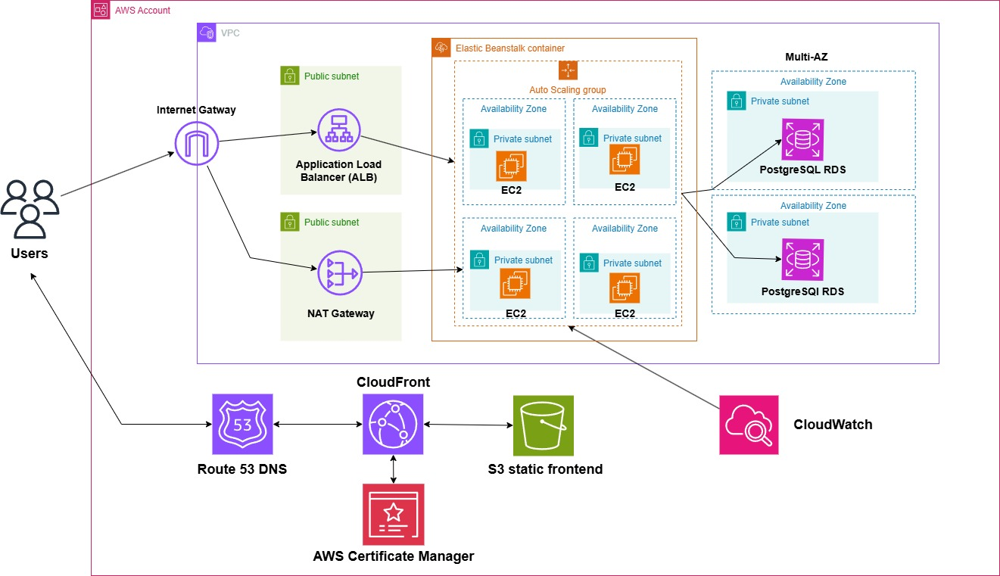

# Lena Beauty Spa Management System

**Live Site:** [lenaspabooking.site](https://www.lenaspabooking.site)

A comprehensive spa appointment booking and management platform built with Java Spring Boot and Angular, featuring customer scheduling, service management, and administrative operations. The system implements clean architecture principles with JWT authentication and AWS cloud deployment.

## Demo

[](https://youtu.be/2Y7xkMZs48A)

*Click to view the complete application demonstration*

## Tech Stack

| Layer | Technology |
|-------|-----------|
| **Backend** | Java Spring Boot, Spring Security, Spring Data JPA, PostgreSQL |
| **Frontend** | Angular 18, TypeScript, Angular Material, RxJS |
| **Authentication** | JWT Bearer Tokens |
| **Email** | Resend API |
| **Infrastructure** | AWS (EC2, RDS, S3, CloudFront, Route 53, Load Balancer) |
| **Monitoring** | AWS CloudWatch |

## System Architecture



The application follows a three-tier architecture pattern deployed on Amazon Web Services, ensuring scalability, reliability, and security.

## Features

### Core Spa Management

- **Appointment Booking**: Create, view, and manage spa appointments with conflict detection
- **Service Management**: 
  - Facial treatments
  - Body massages
  - Nail services
  - Hair styling
- **Customer Management**: Full customer profile and booking history
- **Time Slot Management**: Dynamic availability with automated scheduling
- **Email Notifications**: Automated booking confirmations via Resend API

### Customer Features

- **Account Management**: User registration and profile management
- **Appointment Booking**: Browse services and book appointments
- **Booking History**: View past and upcoming appointments
- **Email Confirmations**: Receive booking confirmations and reminders
- **Multi-language Support**: English and Vietnamese language options
- **Responsive Design**: Seamless experience across desktop and mobile devices

### Admin Portal

- **Dashboard**: Overview of bookings, services, and business metrics
- **User Management**: Manage customer accounts and role assignments
- **Booking Management**: View, modify, and cancel appointments
- **Service Configuration**: Add, edit, and remove spa services
- **Time Slot Configuration**: Set available appointment times
- **Analytics**: Track booking trends and business performance

### Security Features

| Category | Implementation |
|----------|---------------|
| **Authentication** | JWT Bearer Tokens with secure token validation |
| **Authorization** | Role-Based Access Control (RBAC) - Admin and User roles |
| **Password Security** | BCrypt hashing with secure password policies |
| **Transport Security** | HTTPS/TLS via AWS CloudFront and Load Balancer |
| **API Security** | CORS policy, SQL injection prevention via Spring Data JPA |

### Permission Policies

- **ROLE_ADMIN** - Full system access and administrative operations
- **ROLE_USER** - Customer booking and profile management

## Technical Features

- Responsive web interface with Angular Material
- RESTful API architecture
- Environment-based configuration
- Automated email notifications via Resend
- JWT-based stateless authentication
- Role-based route protection
- Multi-language support (English/Vietnamese)
- Real-time booking conflict detection
- Automated time slot management

## Architecture

The application follows a clean architecture pattern with clear separation of concerns:

### Clean Architecture Layers

- **Presentation**: Angular SPA (Components, Services, Guards, Interceptors)
- **Application**: Business logic, services, use cases, DTOs
- **Domain**: Core entities, value objects, business rules
- **Infrastructure**: Spring Boot, PostgreSQL, Resend, AWS integrations

## Configuration

### Environment Variables

Create a `.env` file in the `backend_Lena/backend_Lena` directory with the following variables:

```bash
# JWT Configuration
JWT_SECRET_KEY=your-secret-key-here

# Resend Email Configuration
RESEND_API_KEY=your-resend-api-key
RESEND_FROM_EMAIL=noreply@yourdomain.com
RESEND_FROM_NAME=Lena Spa

# Application Settings
APP_BASE_URL=https://lenaspabooking.site
```

### Database Connection

The application uses PostgreSQL. Configure in `application.properties`:

**Development:**
```properties
spring.datasource.url=jdbc:postgresql://localhost:5432/lena_spa
spring.datasource.username=your_username
spring.datasource.password=your_password
spring.jpa.hibernate.ddl-auto=update
```

**Production:**
```properties
spring.datasource.url=jdbc:postgresql://your-rds-endpoint:5432/lena_spa
spring.datasource.username=${DB_USERNAME}
spring.datasource.password=${DB_PASSWORD}
spring.jpa.hibernate.ddl-auto=validate
```

### AWS CloudWatch Monitoring

The application includes AWS CloudWatch integration for performance monitoring and logging.

**Setup:**
1. Configure AWS credentials with CloudWatch access
2. Application logs are automatically sent to CloudWatch Logs
3. Custom metrics track booking operations and API performance

**Monitored Metrics:**
- API response times
- Booking creation success/failure rates
- User authentication attempts
- Email notification delivery status

## Getting Started

### Prerequisites

- Java 17+
- PostgreSQL 14+
- Maven 3.8+
- Node.js 18+ (for frontend development)
- AWS Account (for deployment)

### Quick Start

**1. Clone the repository**
```bash
git clone https://github.com/nickanhhuy/lena-spa-booking
cd lena-spa-booking
```

**2. Configure environment variables**

Create a `.env` file in `backend_Lena/backend_Lena` directory (see Configuration → Environment Variables).

**3. Setup Database**

Create a PostgreSQL database:

```bash
# Using psql command line
psql -U postgres

# In psql shell
CREATE DATABASE lena_spa;
CREATE USER lena_user WITH PASSWORD 'your_password';
GRANT ALL PRIVILEGES ON DATABASE lena_spa TO lena_user;
\q
```

Or using pgAdmin or any PostgreSQL GUI tool, create a database named `lena_spa`.

**4. Configure Environment Variables**

Create a `.env` file in `backend_Lena/backend_Lena` directory:

```bash
# Database Configuration
DB_HOSTNAME=localhost
DB_PORT=5432
DB_NAME=lena_spa
DB_USERNAME=lena_user
DB_PASSWORD=your_password

# JWT Configuration
JWT_SECRET=your-secret-key-here-make-it-long-and-random
JWT_EXPIRATION=3600000

# Resend Email Configuration
RESEND_API_KEY=your-resend-api-key
RESEND_FROM_EMAIL=noreply@yourdomain.com

# Admin Notification Email
ADMIN_NOTIFICATION_EMAIL=admin@yourdomain.com

# Server Port
PORT=5000
```

**5. Run Backend**
```bash
cd backend_Lena/backend_Lena

# Build and run
./mvnw clean install
./mvnw spring-boot:run
```

The backend will automatically create the necessary database tables on first run (using `spring.jpa.hibernate.ddl-auto=update`).

**6. Run Frontend**
```bash
cd frontend_Lena/frontend_lena

# Install dependencies
npm install

# Development server
npm start
```

**7. Access the application**

- **Frontend**: http://localhost:4200
- **Backend API**: http://localhost:5000/api
- **Admin Portal**: http://localhost:4200/admin

### Connecting to Production Database (AWS RDS)

If you need to connect to the production RDS database:

```bash
# Using psql
psql -h your-rds-endpoint.region.rds.amazonaws.com -U your_username -d lena_spa

# Or update your .env file with production credentials
DB_HOSTNAME=your-rds-endpoint.region.rds.amazonaws.com
DB_PORT=5432
DB_NAME=lena_spa
DB_USERNAME=your_production_username
DB_PASSWORD=your_production_password
```

## Deployment

The application is deployed on AWS with the following components:

**Frontend Deployment:**
1. Build Angular application: `npm run build`
2. Upload to S3 bucket configured for static website hosting
3. CloudFront CDN distribution for global content delivery
4. Route 53 DNS configuration: https://lenaspabooking.site

**Backend Deployment:**
1. Package Spring Boot application: `./mvnw clean package`
2. Deploy JAR to EC2 instances behind Application Load Balancer
3. Auto Scaling Group for dynamic scaling (2-10 instances)
4. Route 53 DNS configuration: https://api.lenaspabooking.site

**Database:**
- RDS PostgreSQL instance in private subnet
- Multi-AZ deployment for high availability
- Automated backups and point-in-time recovery

See `docs/deployment-guide.md` for detailed deployment instructions.

### Production Environment

**Frontend:** https://lenaspabooking.site  
**Backend API:** https://api.lenaspabooking.site  
**Admin Portal:** https://lenaspabooking.site/admin

## API Endpoints

| Method | Endpoint | Description | Auth Required |
|--------|----------|-------------|---------------|
| **Authentication** |
| POST | `/api/auth/register` | User registration | No |
| POST | `/api/auth/login` | User login | No |
| GET | `/api/auth/user` | Get current user profile | Yes |
| PUT | `/api/auth/user` | Update user profile | Yes |
| **Bookings** |
| GET | `/api/bookings` | List all bookings (Admin) | Yes (Admin) |
| GET | `/api/bookings/user` | Get user's bookings | Yes |
| POST | `/api/bookings` | Create new booking | Yes |
| PUT | `/api/bookings/{id}` | Update booking | Yes |
| DELETE | `/api/bookings/{id}` | Cancel booking | Yes |
| **Services** |
| GET | `/api/services` | List all spa services | No |
| POST | `/api/services` | Create service | Yes (Admin) |
| PUT | `/api/services/{id}` | Update service | Yes (Admin) |
| DELETE | `/api/services/{id}` | Delete service | Yes (Admin) |
| **Admin** |
| GET | `/api/admin/dashboard` | Dashboard statistics | Yes (Admin) |
| POST | `/api/admin/setup` | Promote user to admin | Yes (Admin) |
| GET | `/api/admin/users` | List all users | Yes (Admin) |
| GET | `/api/admin/bookings` | All bookings with filters | Yes (Admin) |
| **Health Check** |
| GET | `/api/health` | Application health status | No |

## AWS Infrastructure

| Service | Purpose | Configuration |
|---------|---------|---------------|
| **Amazon EC2** | Spring Boot backend hosting | Auto-scaling instances with health checks |
| **Application Load Balancer** | Traffic distribution | HTTPS termination, health monitoring |
| **Auto Scaling Groups** | Dynamic scaling | 2-10 instances based on CPU utilization |
| **Amazon RDS PostgreSQL** | Managed database | Multi-AZ deployment, automated backups |
| **Amazon S3** | Static website hosting | Angular frontend with versioning |
| **CloudFront CDN** | Global content delivery | HTTPS, edge caching, custom domain |
| **Route 53** | DNS management | Domain routing for frontend and API |
| **VPC** | Network isolation | Public/private subnets, security groups |
| **Security Groups** | Network firewall | Port-level access control |
| **CloudWatch** | Monitoring & logging | Application metrics, log aggregation |
| **CloudWatch Alarms** | Automated alerts | CPU, memory, and error rate monitoring |

## Development Practices

- **Clean Architecture**: Separation of concerns and modular design
- **RESTful Design**: Industry-standard API design principles
- **Security First**: JWT authentication, RBAC, input validation
- **Responsive Design**: Mobile-first approach with Angular Material
- **Code Quality**: TypeScript strict mode, Java best practices
- **Documentation**: Comprehensive API documentation and guides

## Support

For issues and questions, please open an issue in the repository.
